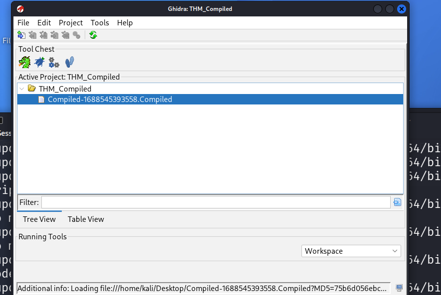
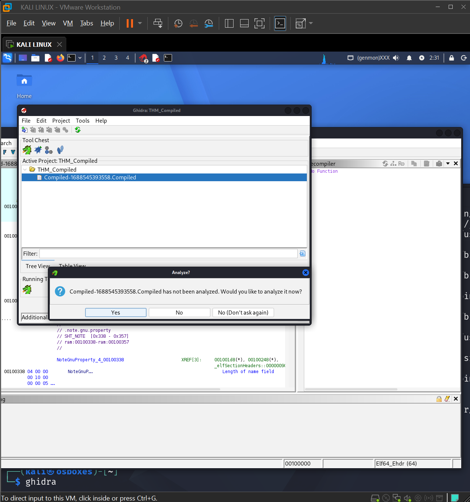
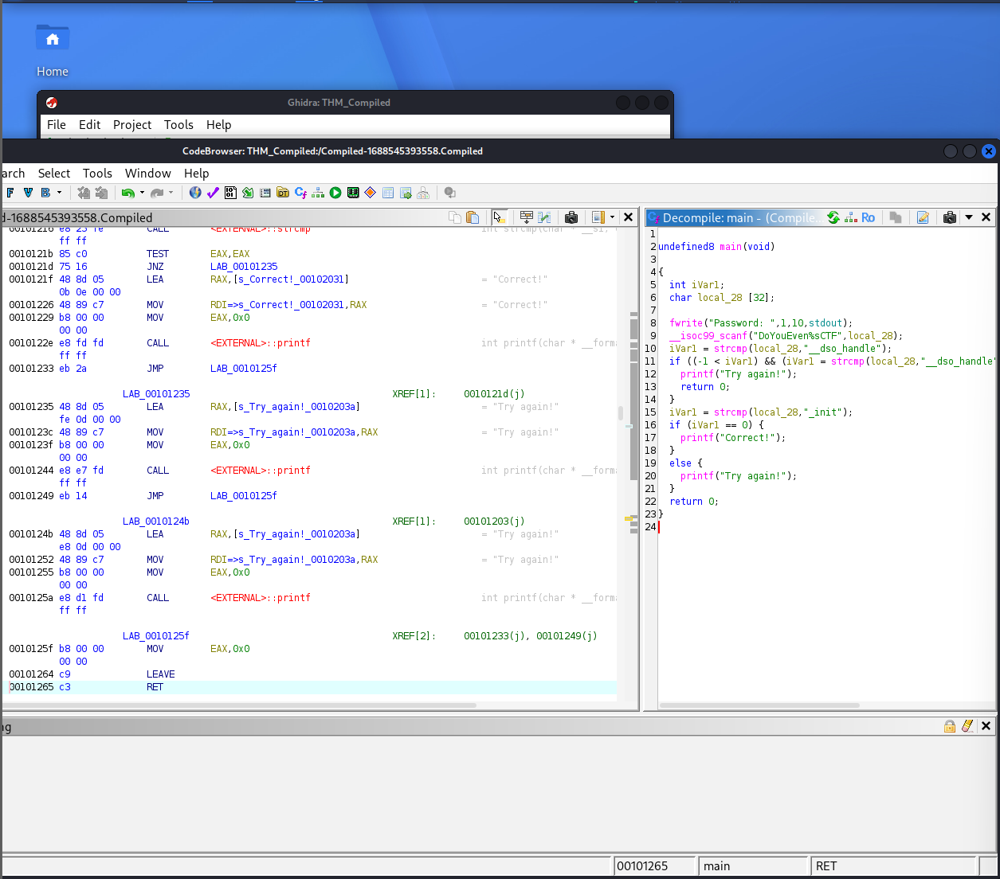
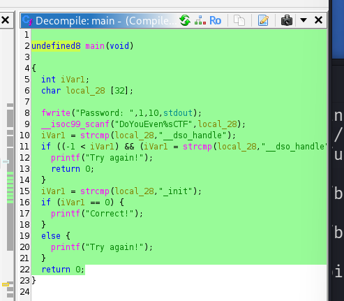
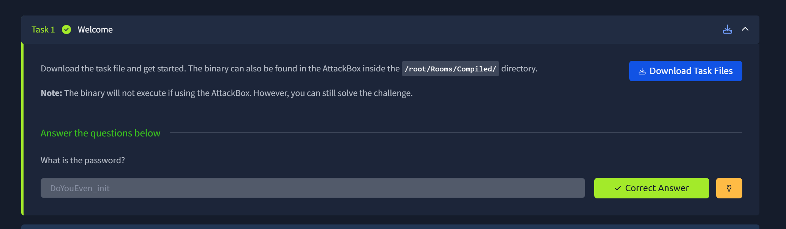
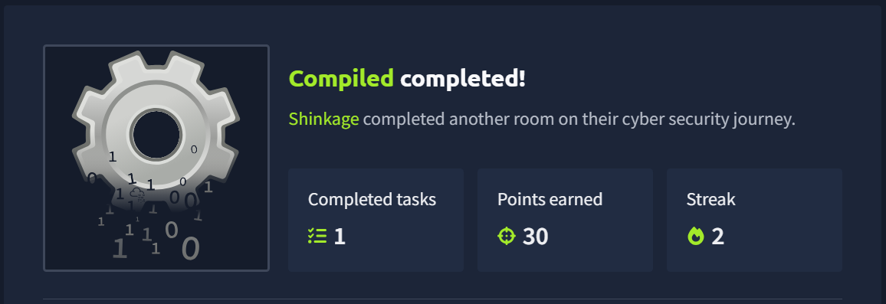

# 🛡️ Compiled - Write-up | TryHackMe


---

## 📝 1. Resumen Ejecutivo (Extracto)

**Compiled** es un reto de dificultad **Fácil** enfocado en el análisis de ejecutables. El objetivo principal de este desafío es tomar un archivo binario proporcionado por la plataforma, descompilarlo para estudiar su flujo de ejecución y analizar su código fuente interno con el fin de descubrir la contraseña oculta que nos dará la bandera (flag) final.

### 🎯 Objetivos de aprendizaje:
*   Uso de herramientas de descompilación y análisis estático "Ghidra".
*   Comprensión de flujos lógicos básicos en código compilado.
*   Identificación de credenciales o contraseñas "hardcodeadas" (escritas directamente en el código).

---

## 📂 2. Recursos y Archivos (Loot)

Para resolver este reto, trabaje con los siguientes elementos:

*   **Descripción oficial en THM:** *"Análisis de un binario compilado para obtener la clave de acceso."* "Los strings solo te servirán hasta cierto punto."
*   **Binario del reto:** [`Compiled-1688545393558.Compiled`](./binary/Compiled-1688545393558.Compiled) *(Ubicado en la carpeta `/binary`)*.

---

## 🔍 3. Procedimiento y Análisis

### Paso 3.1: Análisis Estático Inicial
Antes de ejecutar el archivo o abrirlo en herramientas complejas, realizamos una inspección rápida del binario. 

*   **Identificación del archivo:** Confirmamos el tipo de ejecutable y la arquitectura para la que fue compilado.  
Se realizo el uso de la suit Kali Linux donde una vez descargado el archivo y  mediante el comando **( file Compiled.Compiled)** obtuve los datos:  
[file Compiled.Compiled Compiled.Compiled: ELF 64-bit LSB pie executable, x86-64, version 1 (SYSV), dynamically linked, interpreter /lib64/ld-linux-x86-64.so.2, BuildID[sha1]=06dcfaf13fb76a4b556852c5fbf9725ac21054fd, for GNU/Linux 3.2.0, not stripped]<br><br>
*   **Análisis en Ghidra:** Creamos un nuevo proyecto en **Ghidra**, importamos el binario y dejamos que la herramienta ejecutara su análisis automático por defecto.<br><br>

<p align="center">
<br>  Descripción: Se visualiza el archivo compiled cargado en Ghidra.
</p>

<p align="center">
<br>  Descripción: Se inicia el análsis del compiled.
</p>

---

### Paso 3.2: Localización de la Función Principal y Descompilación
Una vez analizado el archivo, nos dirigimos al panel de **Symbol Tree** (Árbol de Símbolos) en Ghidra para buscar el punto de entrada del programa.  

<p align="center">
<br>  Descripción: Se visualiza el resultado del analisis en Ghidra.
</p>

1. Localizamos la función principal (comúnmente llamada `main` o `entry`).
2. Al seleccionarla, la ventana del **Decompiler** (Descompilador) de Ghidra nos mostró una representación en código legible (similar a C/C++) del flujo del binario:

<p align="center">
<br>  Descripción: Vista de la función analizada en el descompilador de Ghidra donde se aprecia la lógica de comparación de la contraseña.
</p>


---

### Paso 3.3: Análisis del Código y Descubrimiento del Secreto
Al examinar la representación en C generada por el descompilador de Ghidra, identificamos el flujo exacto del programa, el cual se divide en tres etapas lógicas bien definidas:

#### 1. Declaración de Variables y Entrada de Datos
El programa inicia preparando el entorno para recibir nuestra entrada mediante las siguientes instrucciones:

*   **Reserva de memoria:** 
    ```c
    char local_28 [32];
    ```
    Se reserva un buffer de 32 bytes en el stack para almacenar la contraseña que introduzca el usuario.
*   **Prompt en pantalla:**
    ```c
    fwrite("Password: ", 1, 10, stdout);
    ```
    Muestra el mensaje `"Password: "` en la terminal.
*   **Captura de datos (`scanf`):**
    ```c
    __isoc99_scanf("DoYouEven%sCTF", local_28);
    ```
    Aquí se aplica el formato `DoYouEven%sCTF`. Debido al comportamiento codicioso (*greedy*) del especificador `%s` en C, este consume todos los caracteres continuos hasta presionar Enter. Esto provoca que el sufijo literal `CTF` sea ignorado en la práctica, de modo que el texto que escribamos inmediatamente después del prefijo `DoYouEven` se guardará por completo en nuestro buffer `local_28`.

---

#### 2. Primera Validación (Mecanismo de Distracción)
El flujo continúa evaluando una primera condición antes de la comparación final:

```c
iVar1 = strcmp(local_28, "__dso_handle");
```
---

#### 3. Segunda Validación y Obtención de la Clave Correcta
Si logramos superar o evadir la primera validación, el programa realiza la comprobación definitiva:

```c
iVar1 = strcmp(local_28, "_init");
if (iVar1 == 0) {
    fwrite("Correct!\n", 1, 9, stdout);
} else {
    fwrite("Try again!\n", 1, 11, stdout);
}
```
*   **La comparación:** Utiliza strcmp para contrastar directamente nuestro buffer local_28 contra la cadena constante _init (escrita en el código).  
*   **Condición de éxito** Si ambas cadenas son idénticas (iVar1 == 0), se ejecuta el bloque if e imprime el mensaje de victoria: "Correct!".  

---

## 💡 4. Conclusión y Payload Final

*   Para que el flujo del programa marque la entrada como exitosa, la variable local_28 debe contener exactamente el valor _init.
*   Teniendo en cuenta que el prefijo exigido por el formato de scanf es DoYouEven, el payload calculado que debemos introducir en la terminal para resolver el desafío es: **DoYouEven_init**

<p align="center">
<br>  Descripción: Confirmación de la contraseña en el reto.
</p>

<p align="center">
<br>  Descripción: Reto Completado.
</p>